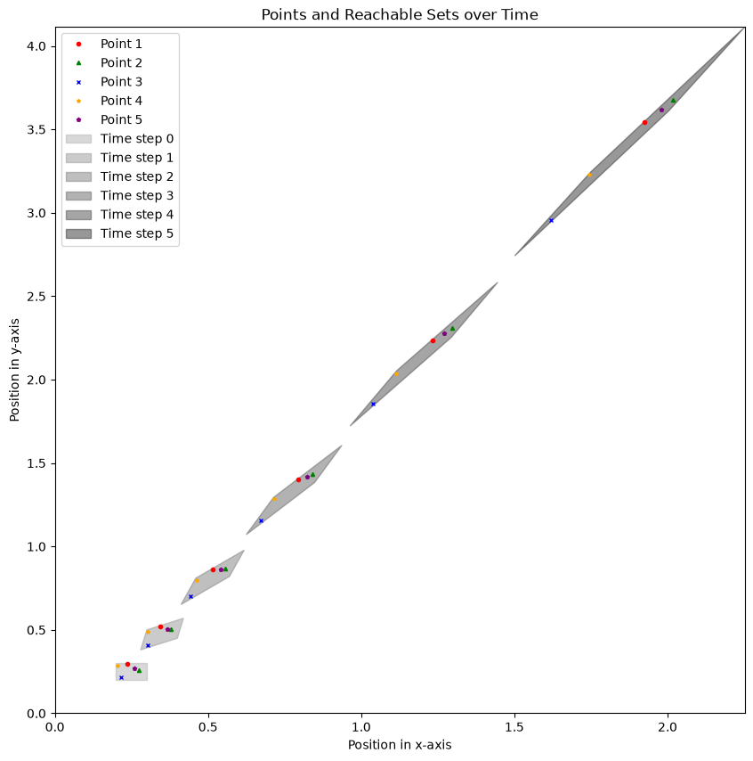

# Assignment 1

Name: Sifat Moonjerin  
Email: smoonjerin@crimson.ua.edu  
CWID: 12636290

## Answer 1

The state transition matrix of the given system is the following.

$$
A = \begin{bmatrix}
1.2 & 0.2 \\
0.7 & 1.2
\end{bmatrix}
$$

The initial state is the following interval set.

$$
z[0] = \begin{bmatrix}
0.2 & 0.3 \\
0.2 & 0.3
\end{bmatrix}
$$

## Answer 2

Two methods are implemented to compute the set of states reached by the system.

### Method 1: Interval Matrix Method

<figure>
    
    <figcaption>Figure 1: Reachable sets using interval matrix method up to T = 5</figcaption>
</figure>

&nbsp;

<figure>
    
    <figcaption>Figure 2: Reachable sets using interval matrix method up to T = 15</figcaption>
</figure>

### Method 2: Vertex Shooting Method

<figure>
    
    <figcaption>Figure 3: Reachable sets using vertex shooting method up to T = 5</figcaption>
</figure>

&nbsp;

<figure>
    
    <figcaption>Figure 4: Reachable sets using vertex shooting method up to T = 15</figcaption>
</figure>

## Answer 3

Five random initial points are selected from within the initial set, and their trajectories are plotted alongside the reachable sets computed using the vertex shooting method. The points are shown in different colors, with each point retaining the same color across all time steps. The points are not connected by lines to improve the clarity of the plot.

<figure>
    
    <figcaption>Figure 5: Random point trajectories and their corresponding reachable sets up to T = 5</figcaption>
</figure>

&nbsp;

<figure>
    
    <figcaption>Figure 5: Random point trajectories and their corresponding reachable sets up to T = 15</figcaption>
</figure>