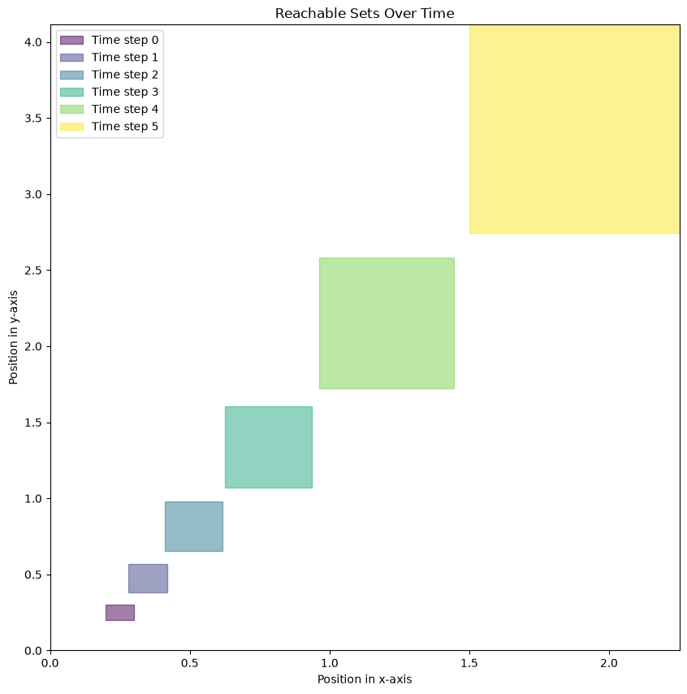
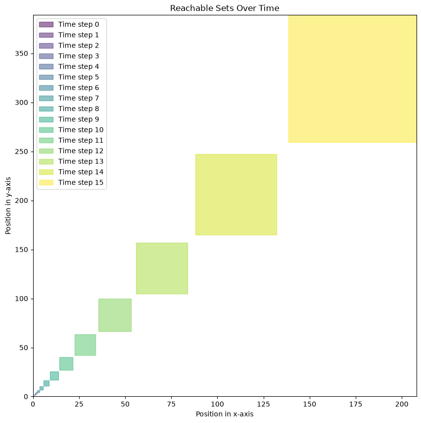
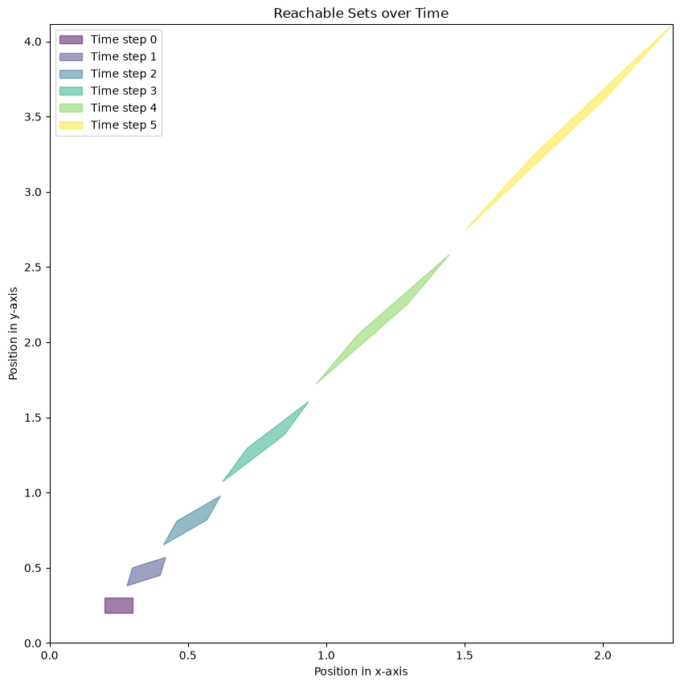
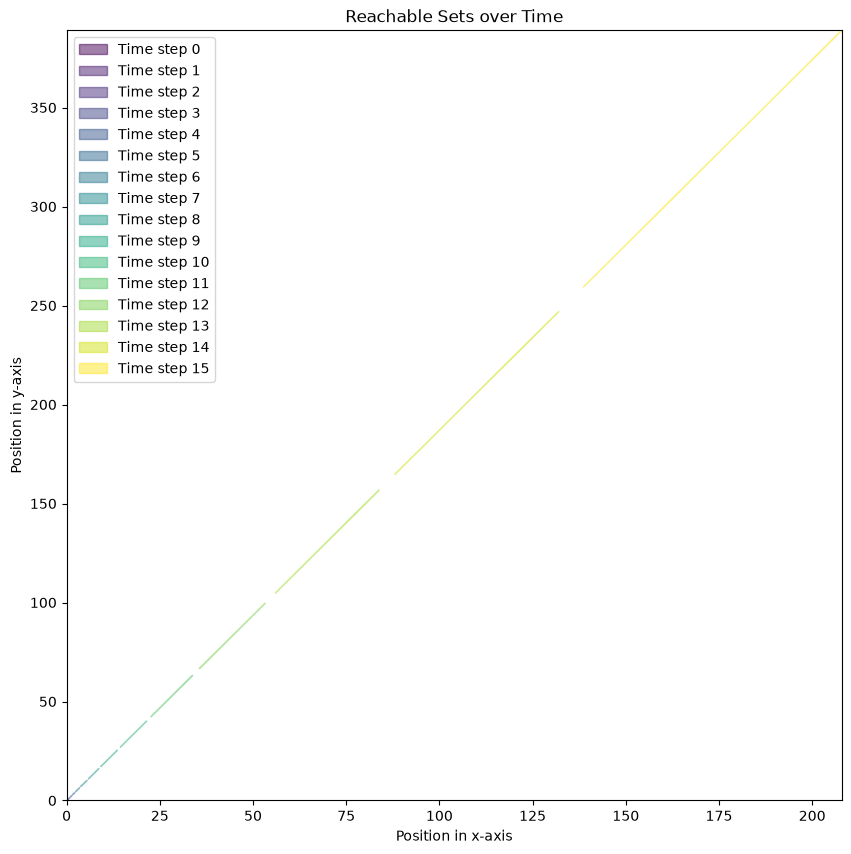
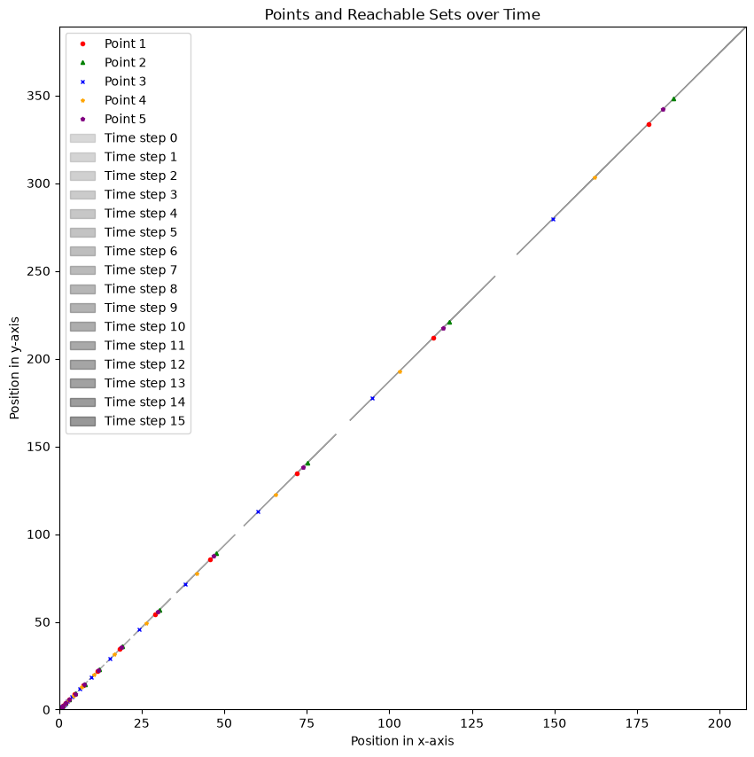

# Assignment 1

Name: Sifat Moonjerin  
Email: smoonjerin@crimson.ua.edu  
CWID: 12636290

## Answer 1

$$
A = \begin{bmatrix}
1.2 & 0.2 \\
0.7 & 1.2
\end{bmatrix}
$$

$$
z[0] = \begin{bmatrix}
0.2 & 0.3 \\
0.2 & 0.3
\end{bmatrix}
$$

## Answer 2

### Method 1: Interval Matrix Method

<figure>
    
    <figcaption>Figure 1: Reachable sets using interval matrix method up to T = 5</figcaption>
</figure>

 

<figure>
    
    <figcaption>Figure 2: Reachable sets using interval matrix method up to T = 15</figcaption>
</figure>

### Method 2: Vertex Shooting Method

<figure>
    
    <figcaption>Figure 3: Reachable sets using vertex shooting method up to T = 5</figcaption>
</figure>

 

<figure>
    
    <figcaption>Figure 4: Reachable sets using vertex shooting method up to T = 15</figcaption>
</figure>

## Answer 3

Trajectories from five random points from the initial set are plotted alongside reachable sets computed via the vertex shooting method.

<figure>
    
    <figcaption>Figure 5: Random point trajectories and their corresponding reachable sets up to T = 5</figcaption>
</figure>

 

<figure>
    
    <figcaption>Figure 5: Random point trajectories and their corresponding reachable sets up to T = 15</figcaption>
</figure>